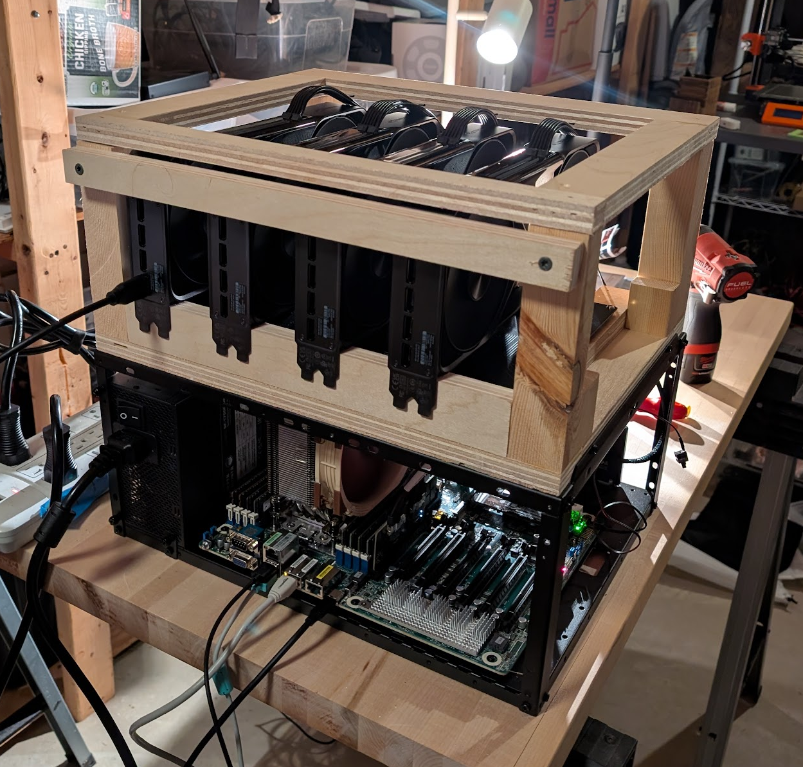

# jamesob's guide to running SOTA LLMs locally

*Note: nothing in this README aside from the tables was written by AI.*

---

Have $2k burning a hole in your pocket and want some local, state-of-the-art machine
intelligence? 

How about $40k?

If Dario and Altman are giving you heartburn (they should be), read on to figure out
how to run this new kind of computing locally.

---

In this repo you'll find

- the hardware I use to run SOTA locally,
  - why I bought what and little-known *secrets* for configuring it,
- how I run speech-to-text (STT) locally,
- ready-to-run configuration for running models I think are good within Docker containers.

## Contents

| Section | TL;DR |
|---|---|
| [How much are you willing to spend?](#how-much-are-you-willing-to-spend) | $2k gets you Qwen and good STT (pretty far!); $40k gets you almost-Opus |
| [Base system](#base-system) | Last-gen EPYC + eBay DDR4 for $5.6k |
| [GPUs](#gpus) | 4× RTX PRO 6000, 384GB VRAM, where the money went |
| [c-payne switch sub-BOM](#c-payne-pcie-gen4-switch-sub-bom-c-paynecom) | Indie PCIe switching so GPUs talk peer-to-peer |
| [GPU enclosure](#gpu-enclosure) | A day of carpentry |
| [Making the switch behave](#getting-the-pci-switches-to-work-properly) | BIOS bifurcation, link speed, ASPM |
| [Kernel / GRUB params](#kernel--grub-parameters) | `iommu=off` or NCCL hangs |
| [ACS disable](#acs-disable-critical-for-switch-p2p) | Keep P2P traffic inside the switch fabric |
| [GPU power limiting](#gpu-power-limiting) | Running $46k of silicon on a 110V circuit |
| [Result](#result) | Gen4 line rate: 27.5/50.4 GB/s, sub-µs latency |
| [`runners/`](./runners) | Ready-to-run serving configs: [GLM-5.2-594B](./runners/GLM-5.2-594B): vLLM docker-compose, DCP4+MTP5, ~80 t/s @ 240k ctx |
| [`runners/stt`](./runners/stt) | Ready-to-run speech-to-text config with `whisper-large-v3` |
| [`tools/`](./tools) | [`measure-gpu-speed.sh`](./tools/measure-gpu-speed.sh): P2P bandwidth/latency benchmark |
| [Resources](#resources) | rtx6kpro repo, c-payne |

## My setup

I was lucky/dumb enough to buy 4x RTX Pro 6000s back when they were cheaper. Because
RAM is now so expensive, I opted to build a last-gen DDR4 system to host these cards,
the parts for which I got off eBay. This allowed me to keep base system cost reasonable
while still getting a lot of VRAM.


Another somewhat unusual thing I did was to use PCIe4 switches (from c-payne.com). This
allows the GPUs to communicate to one another "directly" at wire speeds during the
allreduce step in tensor parallelism, rather than having to send all data through the
PCI root complex. The upshot of this is reduced latency between the cards.

Consequently, I'm spending money on VRAM (where it counts) rather than on a PCIe5/DDR5
base system, which is terrifically expensive as of July 2026.

My particular BOM is detailed below.


### How much are you willing to spend?

#### ~$2k

A great way to go is 2x RTX 3090s for a total of **48GB VRAM** total. You can then run
[Qwen3.6-27B](https://huggingface.co/Qwen/Qwen3.6-27B), which is an awesome model.

You can also run SOTA speech-to-text (STT) with
[`whisper-large-v3`](https://huggingface.co/openai/whisper-large-v3), which I find very
useful. That's the model - you'd then access it with my cross-platform [`stt`
harness](https://github.com/jamesob/stt).

I've found local STT surprisingly useful - and I feel comfortable using it, unlike a
hosted equivalent. You can find a ready-to-run config in
[`./runners/stt`](./runners/stt) that only assumes the presence of ~11GB of VRAM on an
Nvidia GPU.

#### ~$40k

At this price level, you get the next step up in model intelligence. Something pretty
close to Claude Opus.

You'd buy 4x RTX 6000 Pros for a total of **384GB of VRAM**.


##### Current best models for 4x RTX6kPRO

| Date | Best model | My config |
|---|---|---|
| 2026-07 | [`GLM-5.2-Int8Mix-NVFP4-REAP-594B`](https://huggingface.co/madeby561/GLM-5.2-Int8Mix-NVFP4-REAP-594B) | [Runner config](./runners/GLM-5.2-594B) |

##### Other approaches

Note: these are my recommendations, but there are other completely valid ways to spend
your money. For example, there's probably also some regime where rather than getting 4
rtx6kpros, you allocate most of your money to building out a [linked 4x DGX Spark
cluster](https://youtu.be/QJqKqxQR36Y?si=MiKNYtIzut_5pnXy) for a total of 512GB VRAM
and use that as the slow, big brain to drive Qwen3.7-27b to do the rote tasks quickly.


## Hardware

Here's the hardware I wound up purchasing for the 4x RTX 6000 pro machine.

### Base system

A modest, last-gen EPYC system purchased in parts almost entirely from eBay.

| Component | Spec | Price |
|---|---|---|
| Motherboard | ASRock Rack ROMED8-2T (SP3, 7× PCIe 4.0 x16, dual 10GbE) | $715 |
| CPU | AMD EPYC Milan 7313P (16-core 3.0GHz) | $504 |
| RAM | 8× 16GB Crucial CT16G4RFD4213 DDR4 ECC RDIMM (128GB total, eBay) | $642 |
| CPU Cooler | Dynatron T17 SP3 tower, 280W TDP | $40 |
| Case | AAAWave Sluice V2 open frame | $100 |
| PSUs | 2× Super Flower 1700W | $750 |
| PCIe Switch | c-payne Microchip Switchtec PM40100 Gen4 (see sub-BOM below) | ~$1,330 |
| Boot NVMe | 4TB M.2 | $291 |
| Storage NVMe | (2x) 8TB M.2 (model weights) | $1,200 |
| Fans | 3× 120mm PWM | $15 |
| **Total** | | **$5,587** |

### GPUs

| Component | Spec | Price |
|---|---|---|
| GPUs | 4× NVIDIA RTX PRO 6000 Blackwell Workstation (96GB each, **384GB VRAM total**) | **~$46,000** |

### c-payne PCIe Gen4 Switch Sub-BOM (c-payne.com)

| Part | Qty | Unit (€) | Notes |
|---|---|---|---|
| PCIe gen4 Switch 5× x16 — Microchip Switchtec PM40100 | 1 | 1.050 | 2× SlimSAS 8i upstream, 5× x16 quad-width-spaced downstream, aux x4 SlimSAS, 3× 8-pin EPS power |
| SlimSAS PCIe gen4 Host Adapter x16 — REDRIVER AIC (DS160PR810) | 1 | 140 | Plugs into ROMED8-2T x16 slot, feeds switch upstream |
| SlimSAS SFF-8654 8i cable — PCIe gen4 | 2 | ~30 | Each carries x8; pair = x16 upstream |
| **Total** | | | **~€1,220 (~$1,330 USD)** |

### GPU enclosure

I had to custom fabricate a wood enclosure for the PCI switch and GPUs, which took
about a day.



I found the PCI switch's builtin fan very loud and seemingly useless, so I simply
unplugged that from the board.


### Hoarding model weights

I save all model weights locally on a ZFS filesystem that's replicated across the two
8TB drives, which is mounted at `~/storage`.

For any model I want to run, I first download the model using 
```
hf download <model-name> --local-dir ~/storage/<model-name>
```

### Running models

Once the model weights are cached locally, I have a specific directory for each model
that contains a `docker-compose.yml` file that cordones off the running of each model
to its own Docker container.

You can find these configurations in [`./runners/`](./runners).

Each container mounts in `~/storage/models` in read-only mode to obtain the weights
that I've cached locally.

I then use `opencode` hosted on a VM on another machine to access the models once
they're serving on `http://clank.j.co:5000`. 

I use a network-internal DNS server to point `clank.j.co` to the LLM machine, but you
could simply do `http://<llm-machine-ip>:5000` too.


### Getting the PCI switches to work properly

There was a lot of fiddling with the BIOS in order to make sure the motherboard wasn't
downregulating the PCI switch speeds.

#### BIOS Configuration (ROMED8-2T)

| Setting | Value | Why |
|---|---|---|
| `Chipset Configuration → AMD PCIE Link Width` (switch slot) | **x16** (was x8/x8) | Bifurcation was splitting the slot; upstream link trained at Gen4 x8. Requires both SlimSAS 8i cables connected (each carries x8). |
| PCIe Link Speed (switch slot) | **Gen4** (not Auto) | Blackwell Gen5 devices auto-negotiating down through the Gen4 switch could fail training and fall to Gen1. Forcing Gen4 stabilizes it. |
| ASPM | **Disabled** | ASPM L1 drops idle links to 2.5GT/s. This turned out to be the explanation for the "Gen1 downgraded" lspci readings — links were actually running Gen4 under load (verified via p2pBandwidthLatencyTest), but disabling ASPM removes the cosmetic scare and any re-train latency. |
| Re-Size BAR | **Enabled** | Required for full 96GB VRAM BAR exposure and GPU P2P. |
| SR-IOV | **Disabled** | Bare-metal inference; avoids IOMMU overhead and P2P interference. |
| Preferred IO | **Auto** | Optionally set Manual → bus `81` (the c-payne switch) for marginal latency gains, but left at Auto — it's a squeeze-more optimization, not a fix, and bus numbers shift after BIOS changes. |

## Kernel / GRUB Parameters

```bash
# /etc/default/grub
GRUB_CMDLINE_LINUX="iommu=off amd_iommu=off nomodeset"
sudo update-grub

# nvidia_uvm P2P fix
echo 'options nvidia_uvm uvm_disable_hmm=1' | sudo tee /etc/modprobe.d/uvm.conf
sudo update-initramfs -u
```

Without `iommu=off`, NCCL hangs on multi-GPU P2P.

## ACS Disable (critical for switch P2P)

With ACS enabled (default), P2P traffic gets bounced through the CPU root port
instead of staying inside the switch fabric, negating the switch entirely.
`pcie_acs_override` requires a patched kernel, so we disable via setpci at runtime.

```bash
# /usr/local/bin/disable-acs.sh
#!/bin/bash
if [ "$EUID" -ne 0 ]; then
  echo "ERROR: must be run as root"
  exit 1
fi

for BDF in $(lspci -d "*:*:*" | awk '{print $1}'); do
  setpci -v -s ${BDF} ECAP_ACS+0x6.w > /dev/null 2>&1
  if [ $? -ne 0 ]; then
    continue
  fi
  echo "Disabling ACS on $(lspci -s ${BDF})"
  setpci -v -s ${BDF} ECAP_ACS+0x6.w=0000
done
```

Run on every boot via systemd oneshot:

```ini
# /etc/systemd/system/disable-acs.service
[Unit]
Description=Disable PCIe ACS for GPU P2P
After=multi-user.target

[Service]
Type=oneshot
ExecStart=/usr/local/bin/disable-acs.sh

[Install]
WantedBy=multi-user.target
```

Verify: `lspci -vvv | grep ACSCtl` should show all minus signs, and
`nvidia-smi topo -m` should show **PIX** between all four GPUs (not PHB/NODE).

Use [`./tools/measure-gpu-speed.sh`](./tools) to measure this easily.

## GPU Power Limiting

In order to avoid installing a 220V circuit, I (probably unwisely) run this rig on a
single 110V circuit, but I power regulate the cards. 

Persistence mode + power cap applied at boot via systemd
(install-gpu-power-limit.sh):

```bash
sudo nvidia-smi -pm 1
sudo nvidia-smi -pl 350    # 350W per GPU (default 600W)
```

350W/GPU = 1,400W GPU load, sized for the PSU budget. During the interim
single-1700W-PSU phase (before the 240V circuit), cards ran at ~260W
(4×260 = 1,040W GPUs + ~280W system ≈ 1,320W total).

Verify: `nvidia-smi --query-gpu=index,power.limit,power.draw --format=csv`

## Result

Upstream: Gen4 x16 (~30 GB/s to CPU). P2P through switch: **27.5 GB/s
unidirectional / 50.4 GB/s bidirectional, 0.37–0.45 µs latency**, i.e. Gen4 line
rate. Note: lspci may still show downstream GPU links as "2.5GT/s (downgraded)"
at idle if ASPM is active anywhere; this is cosmetic. Links retrain to Gen4
under load.

## Resources

- A frequently updated repo on getting the most out of 4, 6, or 8 RTX 6000 Pro cards: https://github.com/local-inference-lab/rtx6kpro
- Indie PCI switches that I use: https://c-payne.com
